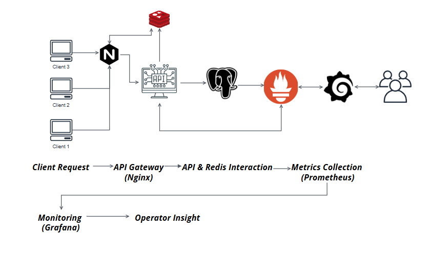

# High-Concurrency Countermeasure System Architecture

架構核心目標
限流保護：防止惡意請求或大量湧入導致 API 當機

高併發應對：快速處理多個使用者同時購買

監控告警：在系統異常（如 Redis 快爆滿）時告警

可部署到地端與雲端：展示不依賴現場網路

# 本專案是為「限流防護」設計的全端架構，包含：

-  限制流量 API（Node.js + Redis 限流）
-  地端 API Gateway（Nginx）
-  即時監控系統（Prometheus + Grafana）
-  支援 EC2 / Minikube / 本地開發

---

#  架構圖

---

